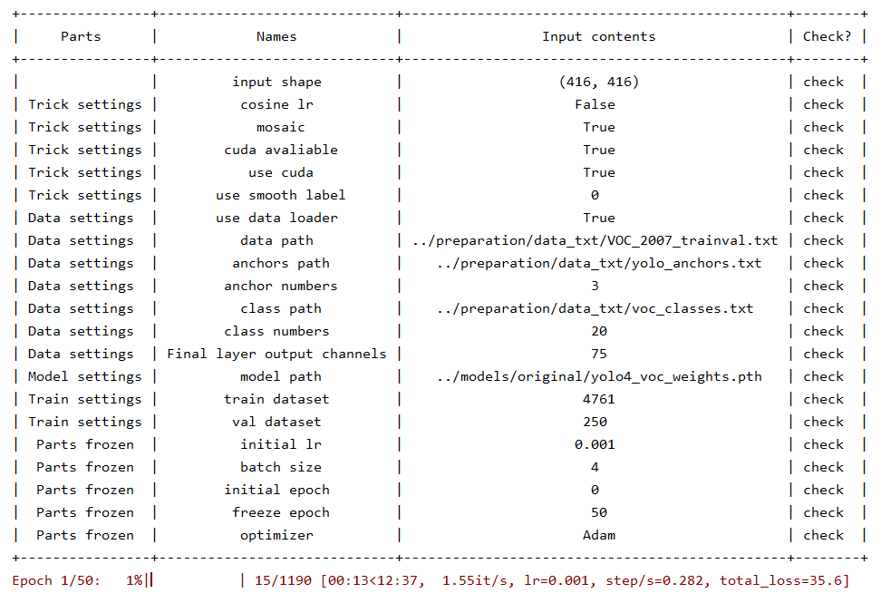

# Mobilenet-Yolov4

Run steps：

1. Split the dataset for train, test, validation

     `python3 preparation/data_split.py` 
     
2. Use K-means to generate the anchors. 
    
    - 9 anchors for 3 scale levels (32, 16, 8)
    - 3 anchors for each scale level
    
    `python3 preparation/kmeans_for_anchors.py` 

3. Translate VOC xml annotations to txt annotations

    `python3 preparation/voc2txt_annotation.py` 
    
4. Training the YoloBody

    `python3 trainer/Train.py` 
    
5. Launch the training 
    
    Train settings will be shown as follows:

    

        
